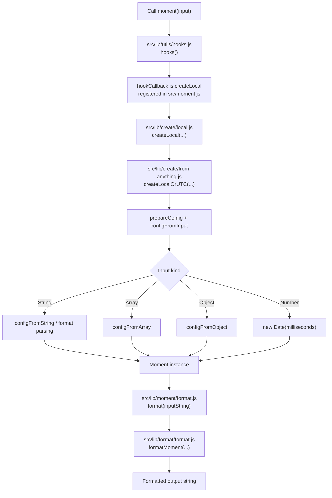

# moment-develop Onboarding (Refreshed)

## Overview
`moment-develop` contains Moment.js source code (`2.30.1`) for date parsing, validation, manipulation, and formatting. The project is in maintenance mode, so onboarding should prioritize architecture comprehension, test-driven verification, and safe incremental changes.

## Structure
- `src/`: primary source.
- `src/lib/`: core modules by domain (`create`, `parse`, `format`, `moment`, `duration`, `units`, `locale`, `utils`).
- `src/locale/`: locale implementations.
- `src/test/`: QUnit behavior specs.
- `moment.js`: generated top-level distributable.
- `dist/`, `min/`: built/minified outputs.
- `tasks/`, `Gruntfile.js`: build/test/release task wiring.
- `typing-tests/`, `ts3.1-typing-tests/`: TypeScript declaration validation.

## Key Modules
- `src/moment.js`: API surface wiring and `setHookCallback(local)` registration.
- `src/lib/utils/hooks.js`: `hooks()` runtime entry that forwards to the registered callback.
- `src/lib/create/local.js`: local creation wrapper (`createLocal`).
- `src/lib/create/from-anything.js`: input dispatch + config preparation across input types.
- `src/lib/moment/format.js`: `format()` on moment instances.
- `src/lib/format/format.js`: token expansion and final formatting engine.

## Beginner Starting Point
Start by tracing one path end-to-end:
1. Call site: `moment(input)`.
2. Runtime dispatch: `hooks()` -> `createLocal`.
3. Parsing/normalization: `createLocalOrUTC` and `prepareConfig`.
4. Output generation: `.format(...)` -> `formatMoment(...)`.

## Example Explanation
Example: format an ISO input with HTML5 constants.

1. Find constants in `src/moment.js` (`moment.HTML5_FMT`).
2. Confirm expected behavior in `src/test/moment/format.js` (`format using constants`).
3. Follow creation path:
- `src/lib/utils/hooks.js` (`hooks`)
- `src/lib/create/local.js` (`createLocal`)
- `src/lib/create/from-anything.js` (`createLocalOrUTC`, `prepareConfig`)
4. Run project checks:
```bash
npm install
npm test
```
5. Optional quick runtime check:
```bash
node -e "const moment=require('./moment'); const m=moment('2016-01-02T23:40:40.678'); console.log(m.format(moment.HTML5_FMT.DATETIME_LOCAL)); console.log(m.format(moment.HTML5_FMT.DATE));"
```
Expected values:
- `2016-01-02T23:40`
- `2016-01-02`

## Learning Path
1. Read `src/moment.js` to map exported API.
2. Deep dive `src/lib/create/*` to understand supported inputs and strictness behavior.
3. Study `src/lib/moment/*` and `src/lib/units/*` for date arithmetic/query semantics.
4. Study `src/lib/format/*` and locale layers in `src/lib/locale/*`.
5. Use `src/test/moment/*.js` as executable documentation for edge cases.
6. Review `Gruntfile.js` + `tasks/` to understand release/build pipeline.

## Mermaid Diagram


