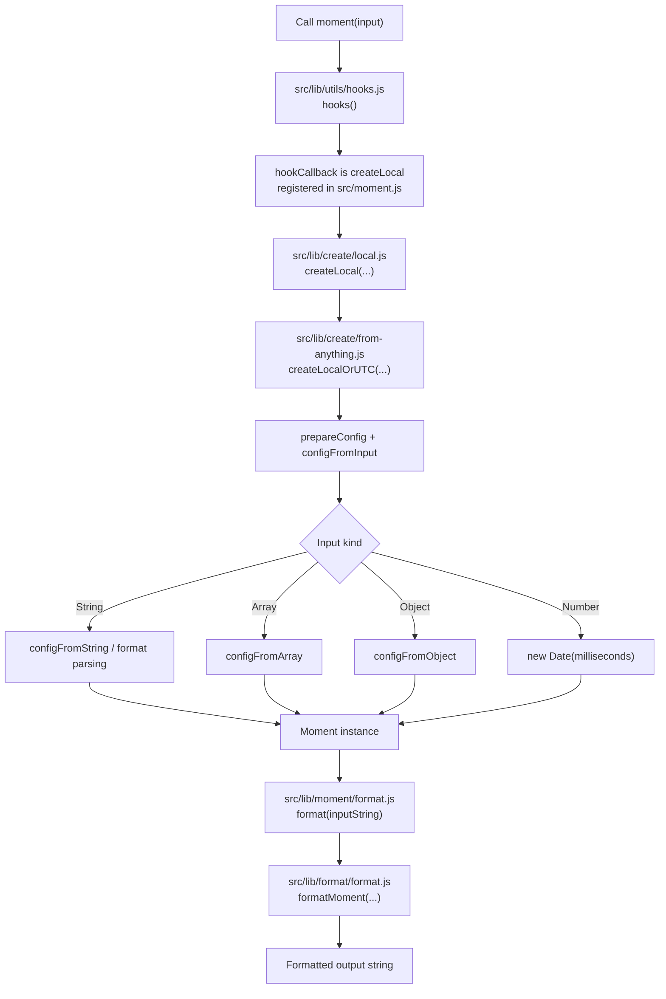

# moment-develop Onboarding

## Overview
`moment-develop` is the Moment.js source repository (version `2.30.1` in `package.json`). Moment.js is a JavaScript date/time library for parsing, validating, manipulating, and formatting dates. The project is in maintenance mode, so onboarding here is mostly about understanding architecture and maintaining behavior.

## Structure
- `src/`: canonical source code.
- `src/lib/`: core implementation split by concern (`create`, `parse`, `format`, `moment`, `duration`, `units`, `locale`, `utils`).
- `src/locale/`: locale definitions in source form.
- `src/test/`: QUnit tests for core and locale behavior.
- `moment.js`: generated distributable main build (CommonJS/AMD/global entry).
- `dist/` and `min/`: built artifacts and minified bundles.
- `tasks/` + `Gruntfile.js`: build/test/release pipeline tasks.
- `typing-tests/` and `ts3.1-typing-tests/`: TypeScript definition checks.

## Key Modules
- `src/moment.js`: source entrypoint wiring public API (e.g., `moment.utc`, `moment.duration`, `moment.locale`, `moment.HTML5_FMT`).
- `src/lib/moment/moment.js`: exports main constructors/helpers (`createLocal`, `createUTC`, `createUnix`, `createInZone`) and prototype binding.
- `src/lib/create/from-anything.js`: central input normalization and parsing dispatch (`string`, `array`, `object`, `number`, `Date`, `Moment`).
- `src/lib/format/format.js`: formatting token execution and output pipeline.
- `src/lib/locale/*`: locale registry, defaults, and formatting/relative-time behavior.
- `src/lib/duration/*`: duration creation/manipulation/humanization.

## Beginner Starting Point
Start with the parse -> create -> format path because it exercises the most central API flow with low cognitive load:
1. API entry in `src/moment.js`.
2. Creation path in `src/lib/create/from-anything.js`.
3. Formatting usage in tests (`src/test/moment/format.js`).

## Example Explanation
### Example Goal
Parse an ISO timestamp and print HTML5-friendly date/time outputs.

### Step 1: Locate the public API constants
In `src/moment.js`, `moment.HTML5_FMT` defines reusable format strings such as `DATETIME_LOCAL` and `DATE`.

### Step 2: Confirm expected behavior in tests
`src/test/moment/format.js` (`format using constants`) validates:
- `moment('2016-01-02T23:40:40.678').format(moment.HTML5_FMT.DATETIME_LOCAL)` -> `2016-01-02T23:40`
- `...format(moment.HTML5_FMT.DATE)` -> `2016-01-02`

### Step 3: Understand how input gets normalized
`src/lib/create/local.js` calls `createLocalOrUTC(...)` in `src/lib/create/from-anything.js`, which prepares config and routes parsing based on input type.

### Step 4: Run a quick local check
```bash
npm install
npm test
```
Optional quick snippet:
```bash
node -e "const moment=require('./moment'); const m=moment('2016-01-02T23:40:40.678'); console.log(m.format(moment.HTML5_FMT.DATETIME_LOCAL)); console.log(m.format(moment.HTML5_FMT.DATE));"
```
Expected output:
```text
2016-01-02T23:40
2016-01-02
```

## Learning Path
1. Read `src/moment.js` to map the top-level API surface.
2. Trace creation internals in `src/lib/create/from-anything.js` and related `from-*` modules.
3. Explore mutation/query logic in `src/lib/moment/*` (`add-subtract`, `diff`, `compare`, `start-end-of`).
4. Study formatting tokens in `src/lib/format/format.js` and date units in `src/lib/units/*`.
5. Use `src/test/moment/*.js` as executable specs for behavior and edge cases.
6. Review `Gruntfile.js` and `tasks/` to understand transpile/test/release flow.

## Mermaid Diagram



